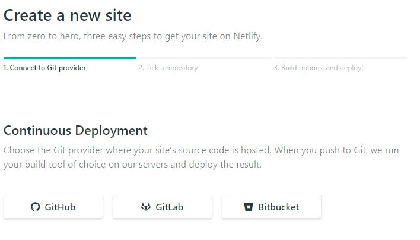
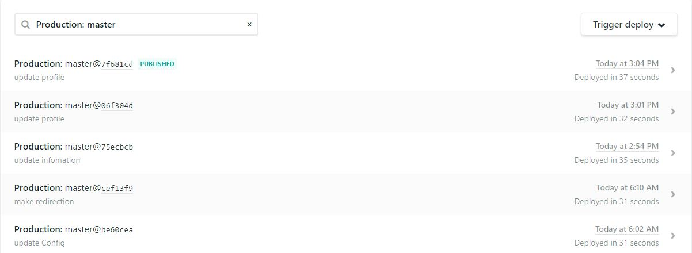
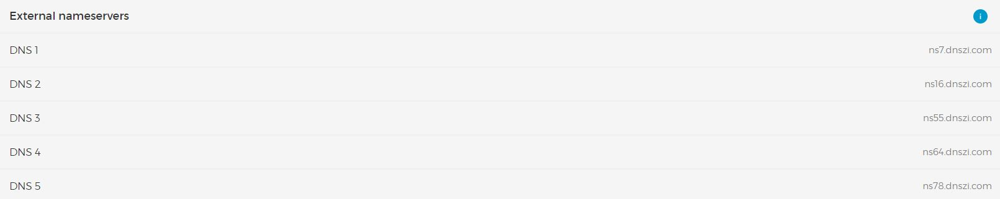
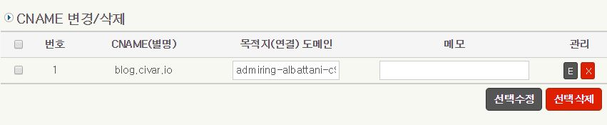
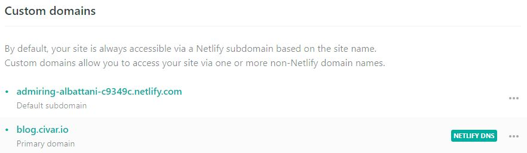
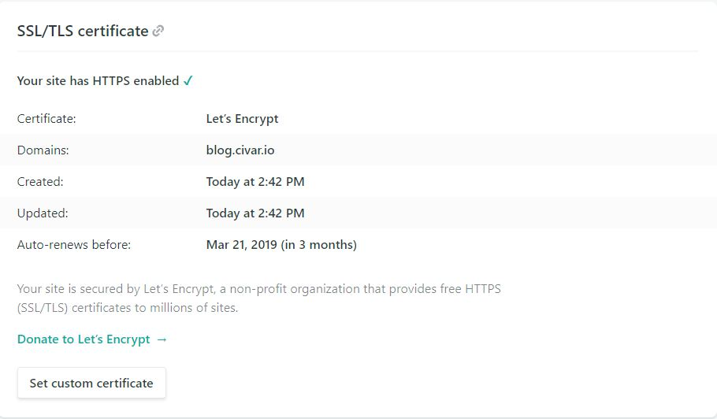

# I'm Start Gatsby

Github 블로그에서의 불편함이 느껴져서 새로운 블로그 플랫폼을 찾던 도중 React로 개발된 Gatsby와 자동으로 빌드배포를 해주는 Netlify를 같이 쓰는 경우가 많다고 듣고 도메인 구입 후 구축해봤다.

  
[이 갯츠비가 아니다!]

## 블로그 플랫폼을 선정하기 까지

기존의 Github Blog는 어려운 Jekyll과 테마가 맘에들지 않았고 뭔가 한국식 블로그처럼 메뉴를 만들고 쓰는데 적합하지 않다고 생각을 했다. Tistory는 로그인 해서 글쓰지는 않을꺼 같고 Medium은 영어 + 한글폰트의 벽에 막혔다 Brunch를 써보고 싶었지만 Brunch는 탈락해도 탈락사유를 알려주지 않아서 접었다. 그러던 줄 Gatsby v2 좋다고 홍보하는 글을 많이 보았고 React도 공부하는 김에 사용해 볼 생각이었다.

## Gatsby

React를 사용해 정적 페이지를 만들어주는 생성기이다.  
실제로 Github Blog의 경우 Jekyll을 사용해 정적페이지를 만들어주는데 Ruby가 익숙하지 않다 보니 조그마한 수정사항에도 머리를 싸매야 하는 어려움이 있었다. 어차피 React를 공부하고 있기 때문에 수정하는데는 크게 어렵지 않을거라고 생각하고 선택을 했다.
참고로 Gatsby는 React + GraphQL 이다. 실제로 블로그 pages하고 article을 다 지우고 빌드 시 graphQL error 가 떠서 신기했던 기억이 있다.

# Start Gatsby

단순히 Gatsby를 사용한다면 yarn을 사용해서 gatsby-cli를 만들면 된다.

```{.bash}
yarn global add gatsby-cli
```

그 후 Node가 그렇듯이 `gatsby new blogName` 를 사용하면 되는데 혹, 쓸만한 보일러 플레이트를 찾았다면 해당 git 주소를 입력하면 된다.

```{.bash}
gatsby new blogName

# 보일러 플레이트 사용 시
gatsby new blogName https://github.com/GatsbyCentral/gatsby-v2-starter-lumen
```

다운 후 `gatsby-config.js` 를 자신에 맞게 수정 후 포스트를 쓰면 된다.

# Netlify는?

정적 페이지를 호스팅, 자동빌드 기타 등등의 유틸을 제공해주는 사이트이다.
jekyll을 사용해본 사람이라면 깃헙에서 자동으로 호스팅 해주는 걸 알것이다.

Netlify의 경우 자동으로 빌드도 해주기 때문에 Github처럼 빌드 후 올릴 필요도 없다. *참고로 무료다*



위에서 처럼 Github 혹은 GitLab, Bitbucket 계정을 선택해 Git Push가 있을시 자동으로 빌드 해준다.



[위 처럼 Git Push 시 자동으로 빌드해 주는걸 볼 수 있다.]

# Domain

언제나 그렇듯이 Domain 문제가 좀 있었는데 Netlify는 자신들이 DNS를 가지고 Custom Domain 연결을 해주는데 현재 **civar.io** 의 경우 Gandinet 에서 구매한 도메인을 Dnszi로 관리하고 있다.

아무 생각없이 Gandinet에 Netlify의 DNS를 등록시키고 작동시켜 봤지만 당연하게도 작동이 되지 않고 DNS를 잡지 못해 **https** 도 적용이 안되는 경우가 생겼다. 자고 일어나서 설정을 다시 했고 아래와 같다

## 최종적으로 DNS는 아래와 같이 설정하였다

[Gandi Net](https://www.gandi.net/en) 은 **.io**를 싸게 살 수 있는 사이트이다.

### Gandi Net



먼저 DNSZI에 Nameserver로 GandiNet의 NameServer를 변경해준다.

### DNSZI

그 후 DNS를 관리해주는 DNSZI로 넘어가서 Netlify에 CNAME을 등록해준다.

DNSZI를 사용한 이유는 **civar.io**는 앞으로 빌드 후 호스팅 한 web에서도 사용하기 위해 구입한 도메인이기 때문에 편하게 DNS를 관리할 수 있는 DNSZI를 채택하게 되었다. 나중에 **CloudFlare**도 생각중이다.



DNSZI에 CNAME으로 Netlify에서 기존으로 제공해주는 Domain을 연결해준다.

### Netlify

Netlify에서 Https 설정과 Domain 설정을 동시에 해줘야 한다.



DNSZI에 CNAME으로 등록했던 Domain 아래에 사용한 Domain이 보인다 이 후, DNS를 검사하는 과정에서 NETLFY DNS가 뜬다면 정상적으로 인식이 된것이다. 모든 서비스는 등록 후 일정 시간 후에 적용되기 때문에 차분히 커피를 한잔 마시면서 기다리는게 좋다.


DNS 설정하면서 헤멘거 생각하면... 커피가 보약이다.

그 후 Https설정을 해주면 되는데 Let's Encrypt를 사용한다.

딱히 해줄 건 없고 DNS Check해주고 인식만 되면 바로 인증서를 발급해준다.



아래와 같이 뜬다면 성공적으로 인식된 것이다.

*사실 DNS 설정으로 헤메지 않았으면 글을 쓸 이유는 없었는데 DNS로 헤멘게 너무 짜증나서 적어보았다.*

# 끝으로...

Github Blog는 큰 Project 를 적기 위한 용도로 쓰고 Netlify는 한국형 블로그 처럼 공부한 내용을 적기 위해서 구축했다 간간히 여행사진과 칵테일 사진도 올라갈 예정이지만 아마 가볍게 사용하는 블로그로써는 파워풀 하다고 생각한다.

참고로 도메인은 욕이 아니라 Cinnamon + Var 의 줄인말이다
*욕하고는 다르다 욕하고는*

그렇다면 오늘은 여기서

