# I'm Start Spring - 1

Spring Boot와 Spring 중에서 뭘 먼저 할지 고민하다가 역시 기본을 하고 나서 개선된걸 사용하는게 좋다고 생각해서 Spring Web MVC를 공부하기로 했다.

사용할 책은 위키북스의 스프링 철저입문이다. 물론 책 내용을 그대로 사용하지는 않고 공부 후, 추가적으로 미니 프로젝트를 할 예정이다.


*보고계시나요 위키북스님...*

# 1st Step: Make Spring Project

먼저 프로젝트 예제를 만들면서 공부할 예정이기 때문에 프로젝트 부터 만들어 보자

스프링을 개발하는데는 현재 **STS** 와 **IntelliJ** 가 제일 유명할 것 같다 대부분의 책에서 **STS** 로 개발을 하는데 나는 **IntelliJ**를 사용해 개발을 할 것이다. 책에서는 STS를 사용하기 때문에 IntelliJ를 사용하는 사람들에게 도움이 되었으면 좋겠다.

## Make Project

먼저 InttliJ에서 New Project로 프로젝트를 만들자

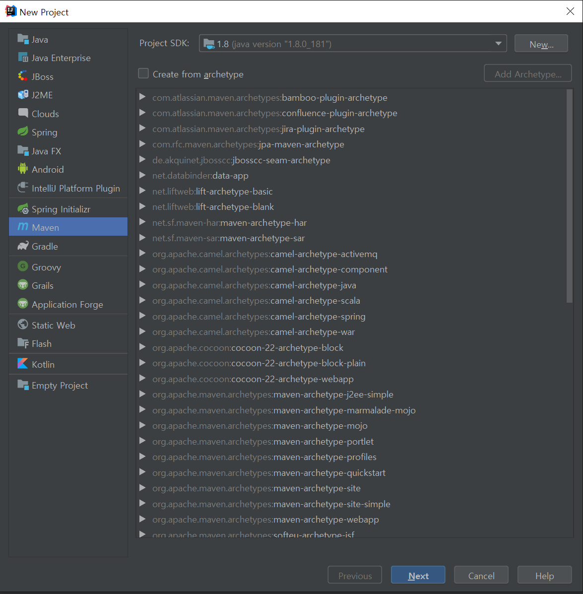

보는거와 같이 Maven으로 프로젝트를 만들면 된다.

그 다음은 **GroupId** 와 **ArtifactId**를 설정해줘야 한다.

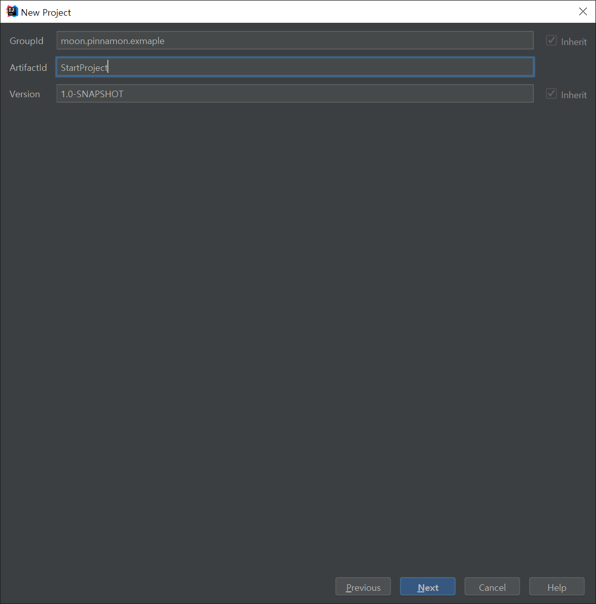

**GroupId**는 Package같은 개념으로 생각하고 **ArtifactId**는 프로젝트 이름으로 생각하면 된다.

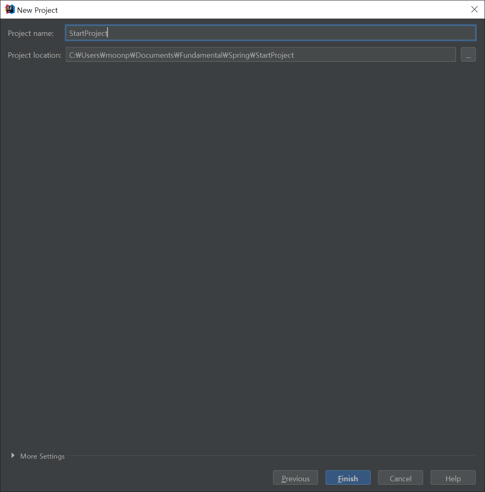

그 후 **Project Name** 을 설정해주는데 딱히 안건들여도 되는 부분이다.

이제 Finish를 눌러주면 빈 프로젝트가 만들어진다. (정말 아무것도 없다 아무것도.)

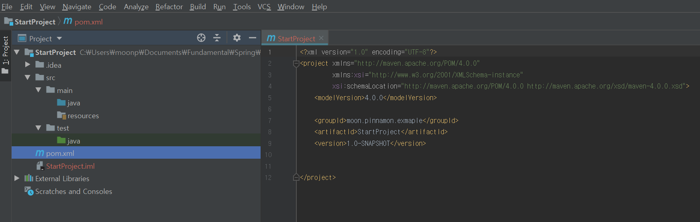

이제 설정을 해보자 IntelliJ의 경우 어느정도 자동으로 만들어주는데 먼저 메뉴에서 우클릭을 하면 Add Framework Support가 보이는데 이걸 사용해서 Spring의 설정을 어느정도 해줄 수 있다.

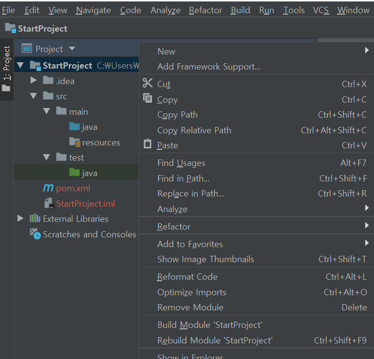

그 후 Spring을 찾아내서 MVC를 눌러서 지정해주자.

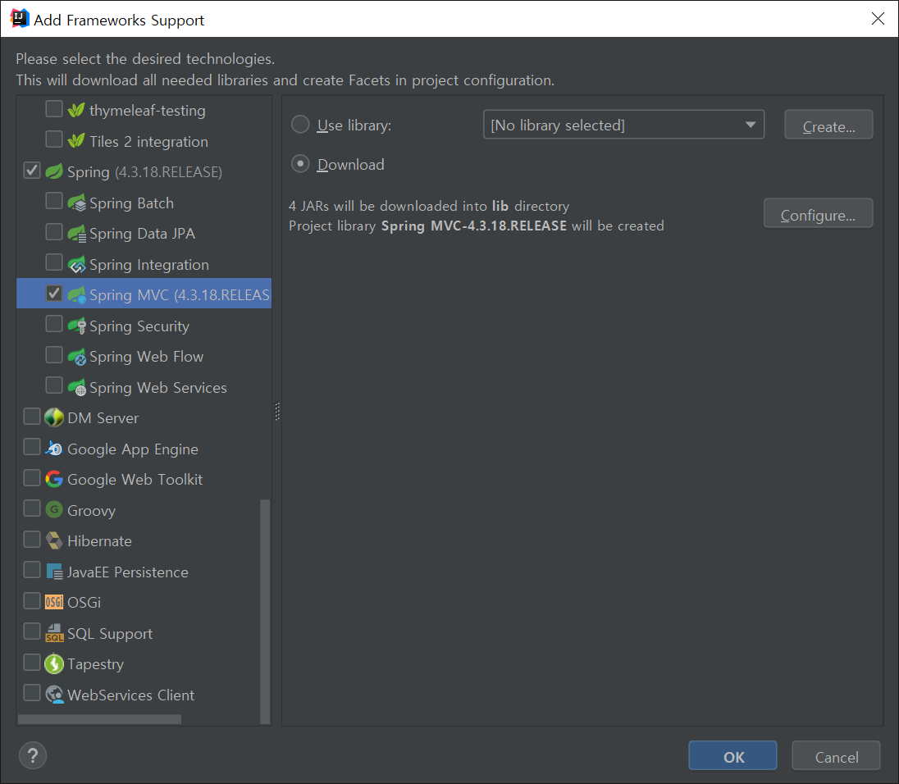

OK버튼을 누르면 약간 구조가 변한걸 볼 수 있다!

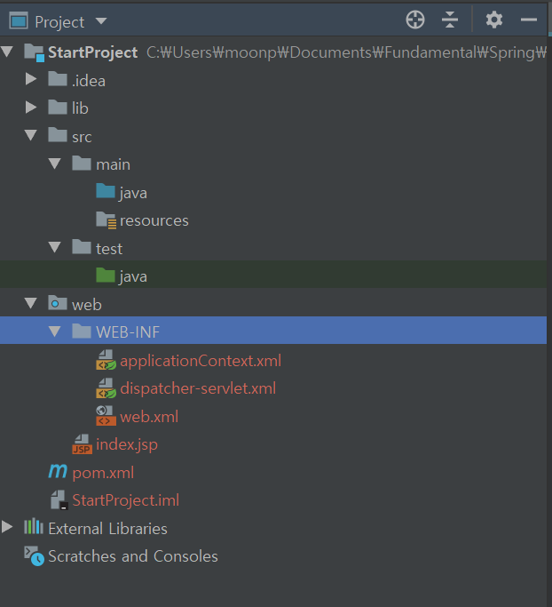

이제 정말 비어있는 프로젝트가 완성되었으니 스프링을 세팅해보자.

# 2nd Step: Setting Project

먼저 기본적인 구조를 보면 **src** 폴더가 있고 그 아래에 **java**와 **resources** 폴더가 있다. 아주 당연하게도 이 부분에 자바의 코드가 들어갈 것이다.

그 후 볼 것은 **web** 폴더인데 **web** 폴더 아래에 있는 **WEB-INF** 폴더와 **applicationContext.xml** 파일과 **dispatcher-servlet.xml** 파일 그리고 **web.xml** 파일이 보인다. 그리고 웹 페이지를 동적으로 그려주는 **JSP** 파일이 보인다. 동적으로 페이지를 그려주는 언어는 **JSP**외에도 여러개 있으나 가장 기본적인 JSP를 사용하고 나중에 다른 언어를 사용해 보는 것으로 한다.

**WEB-INF**폴더가 중요한데 빌드 설정시나 기본 파일이 들어가게 된다. 우리는 **src**폴더 아래에 **config**폴더를 만들어서 **dispatcher-servlet**과 **applicationContext**를 관리하겠지만 전통적인 Spring은 저 두 파일에서 관리를 하게 된다.

이제 **maven**파일인 **pom.xml**을 수정해보자. 책에 보면 version 설정해주는 부분을 지우고 하지만 우리는 maven 사이트에서 라이브러리의 버전을 검색해 직접 넣어줄 것이다.

maven-repo - [ https://mvnrepository.com ]

기존의 pom을 수정 후, 의미하는 걸 알아보자.

### pom.xml 설정

```xml
<?xml version="1.0" encoding="UTF-8"?>
<project xmlns="http://maven.apache.org/POM/4.0.0"
         xmlns:xsi="http://www.w3.org/2001/XMLSchema-instance"
         xsi:schemaLocation="http://maven.apache.org/POM/4.0.0 http://maven.apache.org/xsd/maven-4.0.0.xsd">
    <modelVersion>4.0.0</modelVersion>

    <groupId>moon.pinnamon.exmaple</groupId>
    <artifactId>StartProject</artifactId>
    <packaging>war</packaging>
    <version>1.0-SNAPSHOT</version>
    <name>StartProject Maven WebApp</name>
    <url>http://maven.apache.org</url>

    <dependencyManagement>
        <dependencies>
            <!-- https://mvnrepository.com/artifact/io.spring.platform/platform-bom -->
            <dependency>
                <groupId>io.spring.platform</groupId>
                <artifactId>platform-bom</artifactId>
                <version>Cairo-RELEASE</version>
                <type>pom</type>
                <scope>import</scope>
            </dependency>
        </dependencies>
    </dependencyManagement>

    <dependencies>
        <!-- https://mvnrepository.com/artifact/javax.servlet/javax.servlet-api -->
        <dependency>
            <groupId>javax.servlet</groupId>
            <artifactId>javax.servlet-api</artifactId>
            <version>4.0.1</version>
            <scope>provided</scope>
        </dependency>
        <!-- https://mvnrepository.com/artifact/org.apache.taglibs/taglibs-standard-jstlel -->
        <dependency>
            <groupId>org.apache.taglibs</groupId>
            <artifactId>taglibs-standard-jstlel</artifactId>
            <version>1.2.5</version>
        </dependency>
    </dependencies>

    <build>
        <finalName>StartPj</finalName>
        <pluginManagement>
            <plugins>
                <plugin>
                    <groupId>org.apache.maven.plugins</groupId>
                    <artifactId>maven-compiler-plugin</artifactId>
                    <version>3.8.0</version>
                    <configuration>
                        <source>1.8</source>
                        <target>1.8</target>
                    </configuration>
                </plugin>
            </plugins>
        </pluginManagement>
    </build>
</project>
```

꽤 코드가 길어진 걸 볼 수 있다. 아래에는 xml에 들어간 dependency를 해석할 것이니 관심이 없는 사람은 스크롤을 내려도 좋다. 먼저 맨 위 상단 부분이다.

```xml
<modelVersion>4.0.0</modelVersion>

<groupId>moon.pinnamon.exmaple</groupId>
<artifactId>StartProject</artifactId>
<packaging>war</packaging>
<version>1.0-SNAPSHOT</version>
<name>StartProject Maven WebApp</name>
<url>http://maven.apache.org</url>
```

기존에 만들어 주는 내용에 추가를 한 부분이 있다. **packaging**은 배포 시 어떤 형태로 빌드할 것인가를 지정해주고 **name** 은 Project Full Name **url**은 maven을 지정해준다.

그 후 들어가기에 앞서 현재 쓰고있는 maven의 latest 버전을 어떻게 아는지 적어보자면 위의 Maven-Repo 사이트에 들어가 artifactId 를 검색하면 아래와 같이 뜨게 된다.

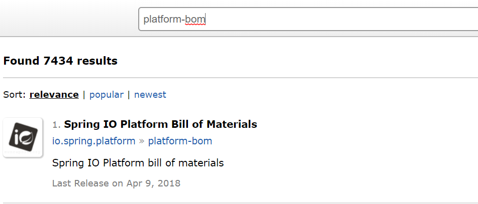

그 후 맞는 Repo를 찾아 들어가면

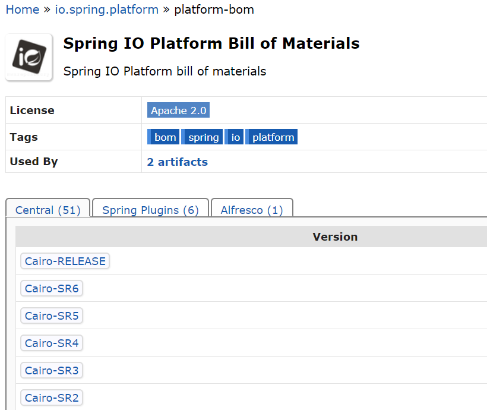

저런식으로 현재 있는 version들을 보여주고 사용하려는 version을 누르면

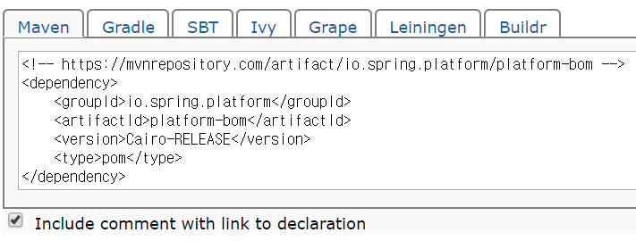

저런식으로 maven문구를 주고 복사하면 된다.

이제 다시 xml파일로 돌아가서 사용하는 dependency에 대해 알아보자.

```xml
<dependencyManagement>
    <dependencies>
        <!-- https://mvnrepository.com/artifact/io.spring.platform/platform-bom -->
        <dependency>
            <groupId>io.spring.platform</groupId>
            <artifactId>platform-bom</artifactId>
            <version>Cairo-RELEASE</version>
            <type>pom</type>
            <scope>import</scope>
        </dependency>
    </dependencies>
</dependencyManagement>
```

먼저 io.spring-platform이다. spring io 빌드를 용이하게 해주는 dependency다. 한마디로 서드파티 라이브러리의 버전관리 의존관계를 어느정도 해결해 주는 dependency다. 사실 io.spring으로 검색하면 spring-boot가 더 많이 나오는데 왜 spring-mvc에서 이걸 사용하는지는 아직은 잘 모르겠다. 혹시 알게되면 추가하겠다.

```xml
<dependencies>
  <!-- https://mvnrepository.com/artifact/javax.servlet/javax.servlet-api -->
    <dependency>
        <groupId>javax.servlet</groupId>
        <artifactId>javax.servlet-api</artifactId>
        <version>4.0.1</version>
        <scope>provided</scope>
    </dependency>
    <!-- https://mvnrepository.com/artifact/org.apache.taglibs/taglibs-standard-jstlel -->
    <dependency>
        <groupId>org.apache.taglibs</groupId>
        <artifactId>taglibs-standard-jstlel</artifactId>
        <version>1.2.5</version>
    </dependency>
</dependencies>
```

dependencis에 추가된 두개의 dependency다 하나는 javax.servlet 다른 하나는 taglibs다. javax.servlet은 JSP를 사용하기 위한 라이브러리고 taglibs는 JSP표준 태그 라이브러리 (JSTL: JSP Standard Tag Library)를 사용하게 해준다.

```xml
<build>
    <finalName>StartPj</finalName>
    <pluginManagement>
        <plugins>
            <plugin>
                <groupId>org.apache.maven.plugins</groupId>
                <artifactId>maven-compiler-plugin</artifactId>
                <version>3.8.0</version>
                <configuration>
                    <source>1.8</source>
                    <target>1.8</target>
                </configuration>
            </plugin>
        </plugins>
    </pluginManagement>
</build>
```

마지막으로 컴파일할 code의 java version을 지정해주는 maven-compiler-plugin이다 필자는 java 1.8을 사용하기 때문에 위와 같이 설정하였다.

이렇게 **pom.xml**의 기본 설정이 끝났다.

물론 간소화 해도 되지만 예제를 따라가는게 목적이니 책에 있는 코드를 기반으로 조금만 수정을 하였다.

나는 **IntelliJ**에 있는 **auto-import**옵션을 켜두었기 때문에 자동으로 추가가 되었지만 자동으로 추가가 안되는 사람은 maven파일을 누르고 re-import 한번이면 전부 추가가 될 것이다.

### web.xml 설정

이제 web.xml을 수정해보자. web.xml은 **applicationContext** 과 **dispatcher-servlet** 외 기타 등등의 설정을 해주는 부분인데 Servlet 3.0 이상부터는 web.xml 설정을 생략할 수 있다고 한다.

```xml
<?xml version="1.0" encoding="UTF-8"?>
<web-app xmlns="http://xmlns.jcp.org/xml/ns/javaee"
         xmlns:xsi="http://www.w3.org/2001/XMLSchema-instance"
         xsi:schemaLocation="http://xmlns.jcp.org/xml/ns/javaee http://xmlns.jcp.org/xml/ns/javaee/web-app_4_0.xsd"
         version="4.0">
    <context-param>
        <param-name>contextConfigLocation</param-name>
        <param-value>/WEB-INF/applicationContext.xml</param-value>
    </context-param>
    <listener>
        <listener-class>org.springframework.web.context.ContextLoaderListener</listener-class>
    </listener>
    <servlet>
        <servlet-name>dispatcher</servlet-name>
        <servlet-class>org.springframework.web.servlet.DispatcherServlet</servlet-class>
        <load-on-startup>1</load-on-startup>
    </servlet>
    <servlet-mapping>
        <servlet-name>dispatcher</servlet-name>
        <url-pattern>*.form</url-pattern>
    </servlet-mapping>
</web-app>
```

기존의 web.xml을 아래와 같이 수정해야 한다.

```xml
<?xml version="1.0" encoding="UTF-8"?>
<web-app xmlns="http://xmlns.jcp.org/xml/ns/javaee"
         xmlns:xsi="http://www.w3.org/2001/XMLSchema-instance"
         xsi:schemaLocation="http://xmlns.jcp.org/xml/ns/javaee http://xmlns.jcp.org/xml/ns/javaee/web-app_4_0.xsd"
         version="4.0">
    <jsp-config>
        <jsp-property-group>
            <url-pattern>*.jsp</url-pattern>
            <page-encoding>UTF-8</page-encoding>
            <include-prelude>/WEB-INF/include.jsp</include-prelude>
        </jsp-property-group>
    </jsp-config>
</web-app>
```

갑자기 확 줄어들었는데 지금 만들고 있는 프로젝트는 hello world로 jsp 만 띄워주면 되기 때문에 spring보다는 jsp에 더 가깝다.

변경된 jsp-config에 대해 설명을 해보자면

```xml
<jsp-config>
    <jsp-property-group>
        <url-pattern>*.jsp</url-pattern>
        <page-encoding>UTF-8</page-encoding>
        <include-prelude>/WEB-INF/include.jsp</include-prelude>
    </jsp-property-group>
</jsp-config>
```

**url-pattern** 으로는 jsp를 사용하고 **encoding** 으로는 UTF-8, 시작시 기본적으로 include 할 jsp 파일 (taglib를 사용하도록 해주는) 을 지정해둔다.

그리고 /WEB-INF/ 디렉토리 아래에 include.jsp를 아래와 같이 작성해 추가해줘야 한다.

```jsp
<%@ taglib prefix="c" uri="http://java.sun.com/jsp/jstl/core" %>
<%@ taglib prefix="fmt" uri="http://java.sun.com/jsp/jstl/fmt" %>
<%@ taglib prefix="fn" uri="http://java.sun.com/jsp/jstl/functions" %>
```

이제 기본적인 설정이 끝났다. 필요없는 파일을 삭제하고 정리하면 최종적인 폴더 구조는 아래와 같이 되어있을 것이다.

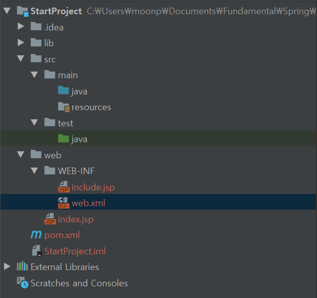

## 어플리케이션 실행

프로젝트 설정이 끝났으면 이제 정상적으로 시작이 되는지 확인을 해봐야 하지 않겠는가? 배포 설정을 하고 페이지를 출력해보자.

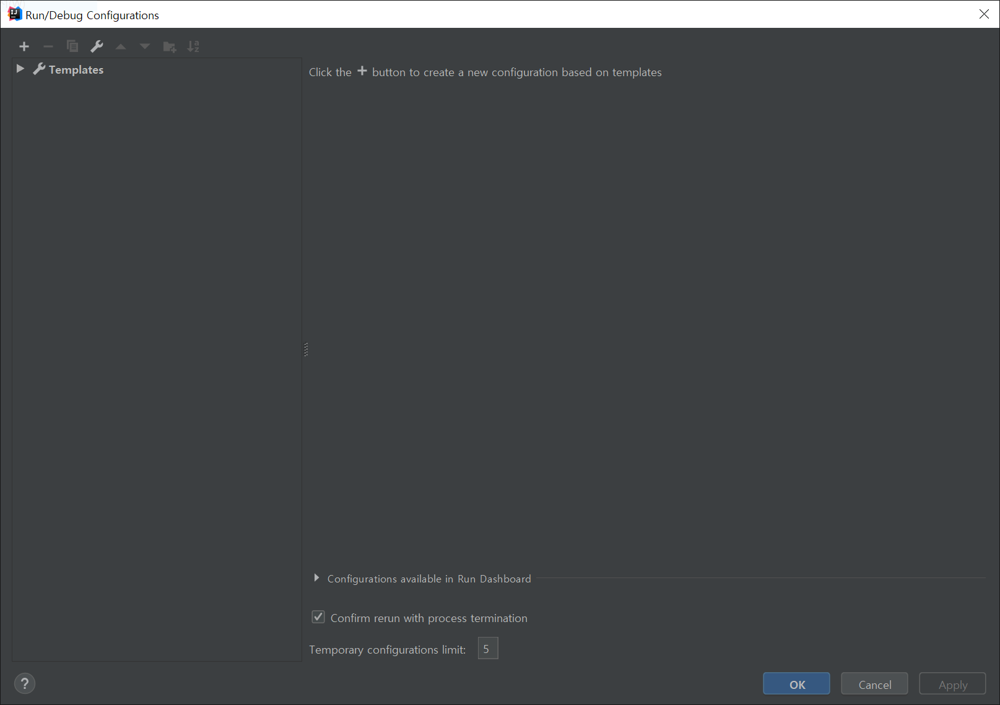

**Add configuration** 버튼을 눌러보면 위와 같은 창이 뜨는데 아무것도 설정이 되어있지 않은걸 볼 수 있다. 기본적으로 **Tomcat** 과 **Java의 환경변수** 는 되어있다는 가정 하에 진행을 하겠다.

아무 것도 하지 않고 단순히 Local의 톰캣을 클릭하면 아래와 같이 만들어진다.

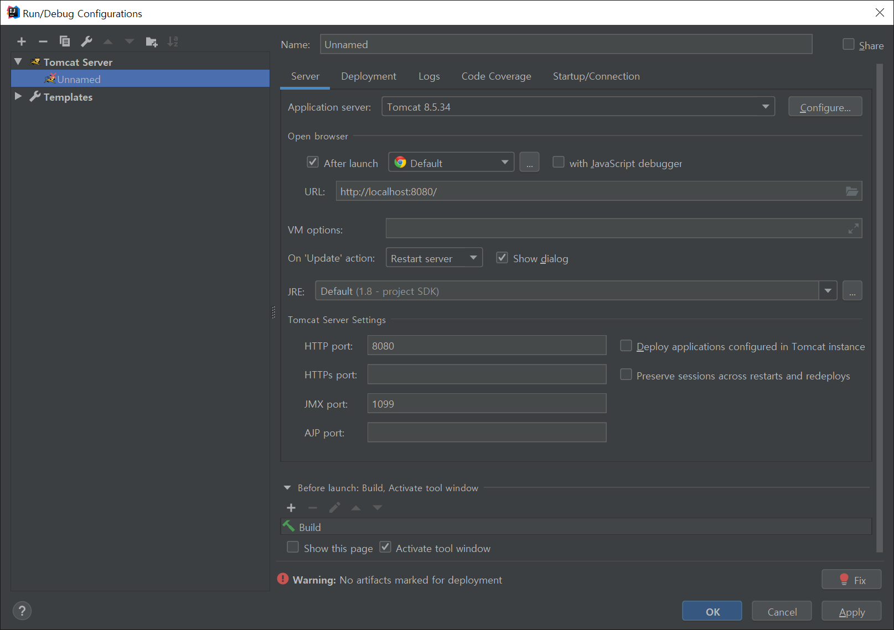

이제 설정을 해주자 먼저 fix 버튼을 누르면 deploy를 설정하라고 하는데 지금 우리는 artifacts를 지정하지 않았기 때문에 생기는 문제다. deploy에 있는 add 버튼을 누르면 아래와 같이 뜨는데

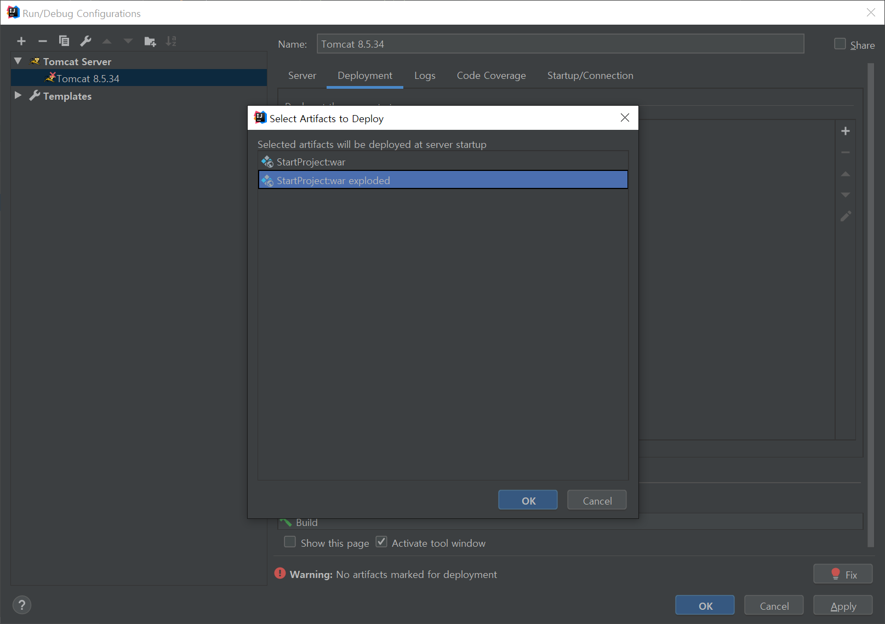

exploded를 추가해주자. war과 exploded의 차이는 단순하게 war파일로 만들었나 소스코드를 실행하는것인가 정도의 차이다.

이제 아래와 같이 추가가 된 걸 볼 수 있을 것이다.

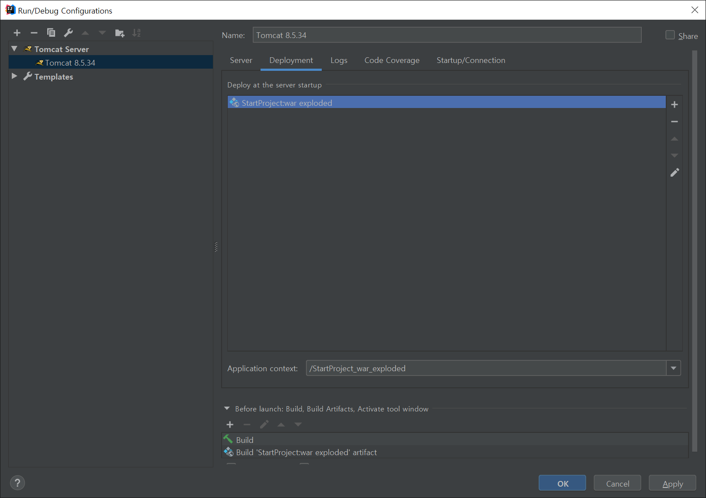

이제 설정을 끝내주고 추가적으로 exploded도 설정을 해주자 왜냐하면 아래와 같이 /WEB-INF/ 폴더의 경로를 찾지 못해 빨간색으로 설정이 되는데 이걸 잡아주기 위해서 이다.

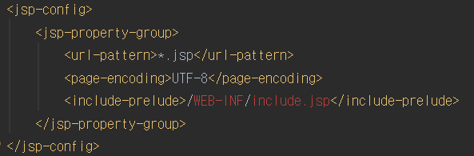

윈도우 기준 F4를 누르면 설정화면이 뜨는데 거기서 Facets에 들어가 WEB-INF 경로를 다시 잡아줘야 한다.

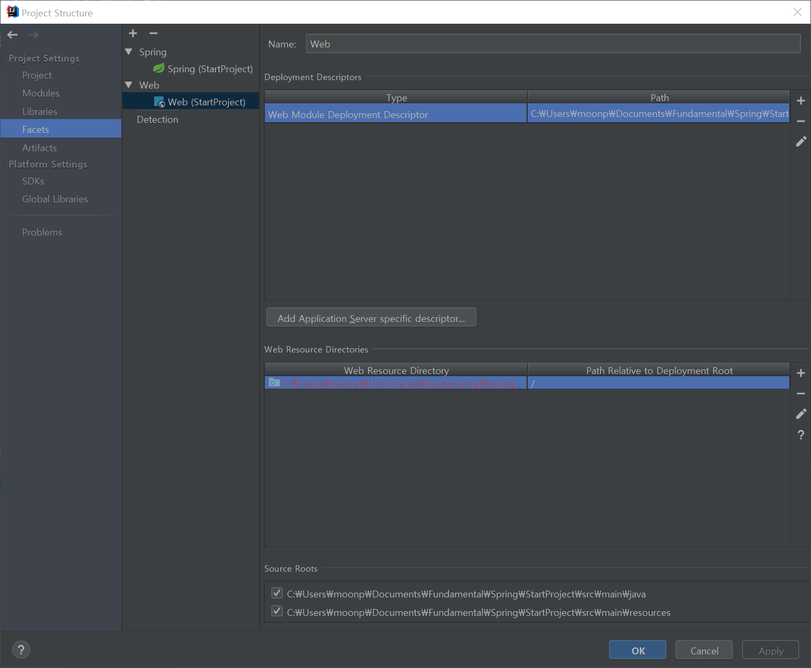

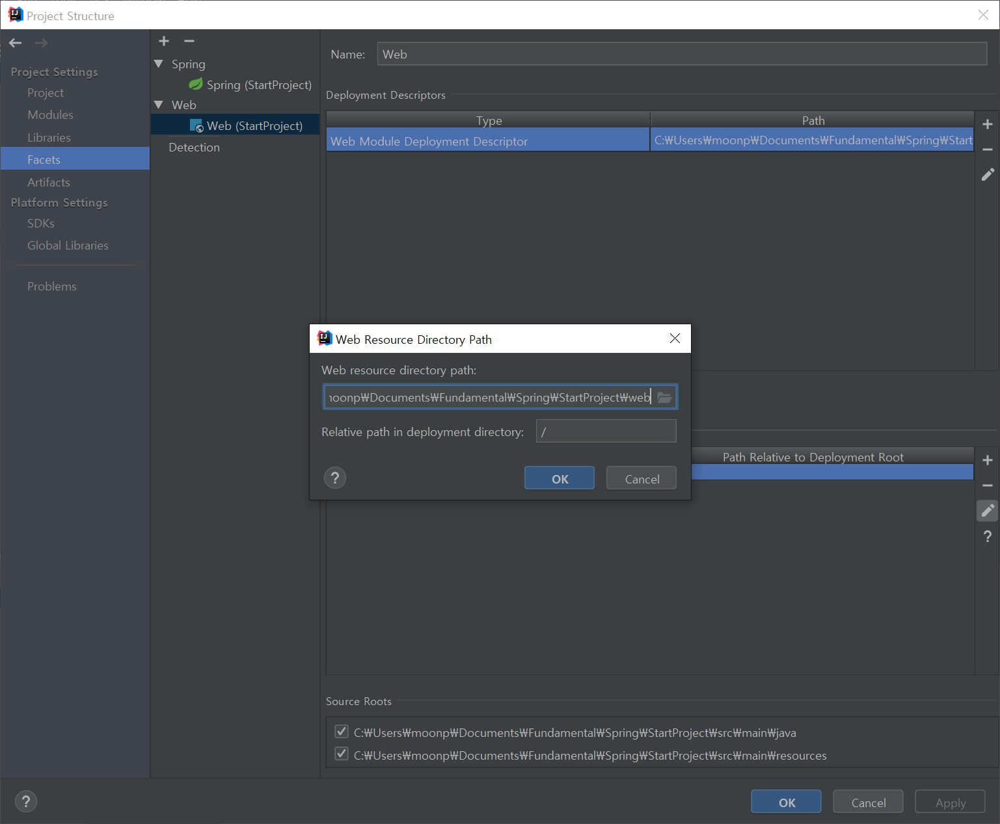

이제 **web.xml**에 들어가면 정상적으로 에러가 사라진걸 볼 수 있다.

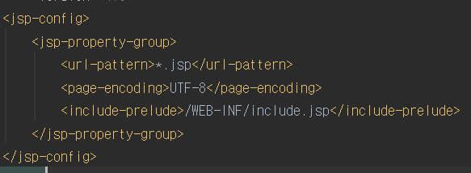

Run 버튼을 누르고 index.jsp 가 뜨는걸 보자 아래와 같이 에러 없이 뜨면 해결된 것이다.

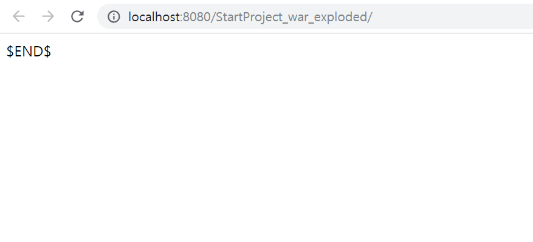

# 다음은...

이번 프로젝트는 Spring 보다는 JSP 프로젝트에 좀 더 가까운 것이다. 다음은 Spring-WebMVC를 사용해 Echoform을 만들어서 간단한 Spring 프로젝트를 진행할 것이다.