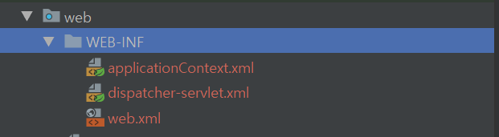
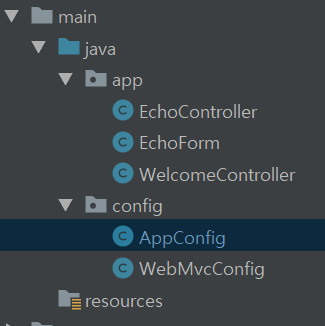
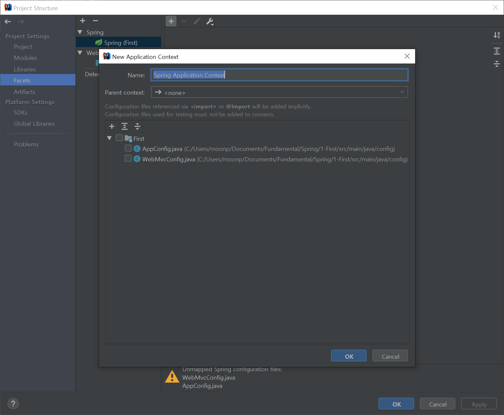
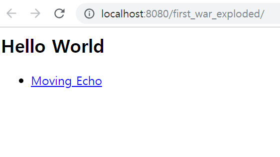
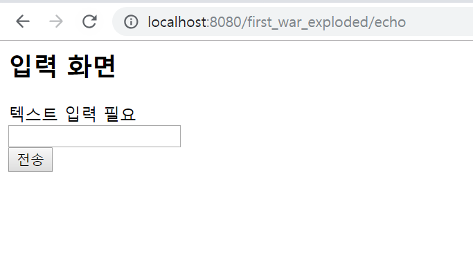
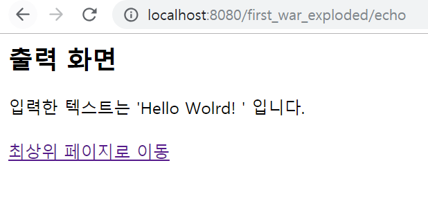
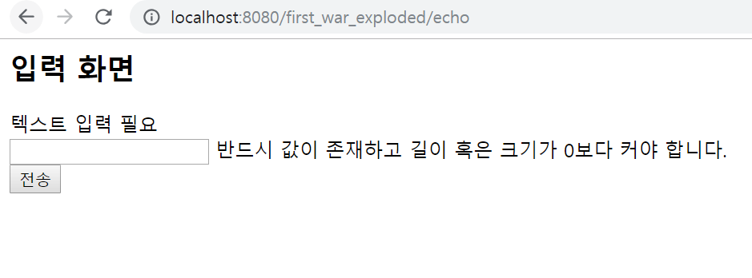
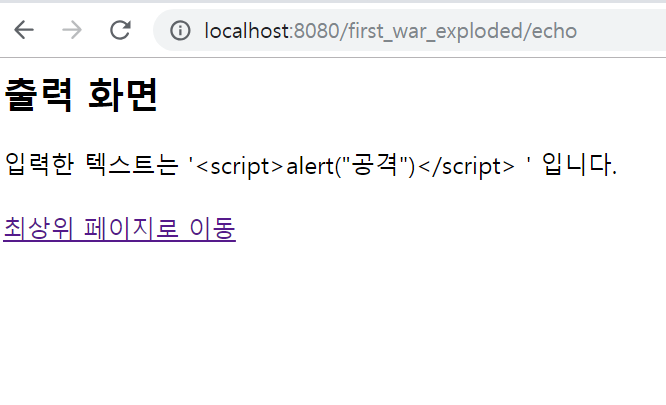

# I'm Start Spring - 2

저번에는 maven으로 jsp를 띄우는 것을 했었다. 이번에는 Spring-WebMVC를 사용해 Echoform을 만들어 본다.

# 1st Step: Make Spring Project

저번이랑 똑같이 프로젝트를 만들고 설정을 동일하게 해주면 된다.


# 2nd Step: Setting pom.xml

먼저 **pom.xml**의 설정부터 변경해보자 **maven-repo**에 들어가서 아래와 같이 찾아서 추가를 해준다.

```xml

<dependencies>

~~~생략~~~
    <!-- https://mvnrepository.com/artifact/org.springframework/spring-webmvc -->
    <dependency>
        <groupId>org.springframework</groupId>
        <artifactId>spring-webmvc</artifactId>
        <version>4.3.18.RELEASE</version>
    </dependency>
    <!-- https://mvnrepository.com/artifact/org.hibernate.validator/hibernate-validator -->
    <dependency>
        <groupId>org.hibernate.validator</groupId>
        <artifactId>hibernate-validator</artifactId>
        <version>6.0.13.Final</version>
    </dependency>
    <!-- https://mvnrepository.com/artifact/org.slf4j/jcl-over-slf4j -->
    <dependency>
        <groupId>org.slf4j</groupId>
        <artifactId>jcl-over-slf4j</artifactId>
        <version>1.7.25</version>
    </dependency>
    <!-- https://mvnrepository.com/artifact/ch.qos.logback/logback-classic -->
    <dependency>
        <groupId>ch.qos.logback</groupId>
        <artifactId>logback-classic</artifactId>
        <version>1.2.3</version>
        <scope>test</scope>
    </dependency>
</dependencies>
```

이제 무엇이 추가되었는지 확인해보자

```xml
<!-- https://mvnrepository.com/artifact/org.springframework/spring-webmvc -->
<dependency>
    <groupId>org.springframework</groupId>
    <artifactId>spring-webmvc</artifactId>
    <version>4.3.18.RELEASE</version>
</dependency>
```

먼저 **Spring-webmvc**다. **Spring-webmvc**를 사용해야 하니 추가했는데 **Spring 5**가 최신이지만 예제가 Spring 4라 4를 추가했다.

```xml
<!-- https://mvnrepository.com/artifact/org.hibernate.validator/hibernate-validator -->
<dependency>
    <groupId>org.hibernate.validator</groupId>
    <artifactId>hibernate-validator</artifactId>
    <version>6.0.13.Final</version>
</dependency>
```

**Hibernate Validator**은 **SpringMVC**의 **Bean Validation**에 대한 유효성을 검증해주는 dependency 이다.

```xml
<!-- https://mvnrepository.com/artifact/org.slf4j/jcl-over-slf4j -->
<dependency>
    <groupId>org.slf4j</groupId>
    <artifactId>jcl-over-slf4j</artifactId>
    <version>1.7.25</version>
</dependency>
<!-- https://mvnrepository.com/artifact/ch.qos.logback/logback-classic -->
<dependency>
    <groupId>ch.qos.logback</groupId>
    <artifactId>logback-classic</artifactId>
    <version>1.2.3</version>
    <scope>test</scope>
</dependency>
```

Spring은 기본적으로 **JCL**을 사용해 로그 출력을 한다 그래서 **SLF4J**에 logging 처리를 넘겨주는 디펜던시와 **SLF4J** 구현 라이브러리인 Logback을 추가해줬다.

# 3rd ContextLoaderListener 설정

저번에 삭제했던 xml 파일들을 우리는 **src/java**에 **class**로 설정 해 줄 것이다. 먼저 ContextLoaderListener의 설정을 해보자.



[ 그래 이 파일들... ]

**src/java**에 선언을 할 것이기 때문에 폴더 구조가 아래와 같이 되어야 한다.



먼저 **java**폴더 하위에 아무것도 없을 것이기 때문에 **config** 패키지를 만들고 **AppConfig.class**를 만들어서 아래와 같이 작성해준다.

```java
package config;

import org.springframework.context.annotation.Configuration;

@Configuration
public class AppConfig {

}
```

지금은 추가로 작성할 내용이 없기 때문에 비어있는 **Config** 파일이다.

이후 이걸 **web.xml**에 등록을 시켜야 한다. **web.xml**파일을 열고 아래와 같이 추가로 작성해준다.

```xml
<listener>
    <listener-class>
        org.springframework.web.context.ContextLoaderListener
    </listener-class>
</listener>

<context-param>
    <param-name>contextClass</param-name>
    <param-value>
        org.springframework.web.context.support.AnnotationConfigWebApplicationContext
    </param-value>
</context-param>

<context-param>
    <param-name>contextConfigLocation</param-name>
    <param-value>config.AppConfig</param-value>
</context-param>
```

먼저 컨테이너의 Listener Class로 **ContextLoaderListener**를 지정해주고 contextClass로는 **AnnotationConfigWebApplicationContext**를 지정해준다 그 후 아까 작성한 **AppConfig.class**를 지정해준다.

# 4th DispatcherServlet 설정

이제 **DispatcherServlet**를 설정해보자. 아까 그 **config 패키지** 아래에 **WebMvcConfig** 파일을 만들고 아래와 같이 작성해준다.

```java
package config;

import org.springframework.context.annotation.ComponentScan;
import org.springframework.context.annotation.Configuration;
import org.springframework.web.servlet.config.annotation.EnableWebMvc;
import org.springframework.web.servlet.config.annotation.ViewResolverRegistry;
import org.springframework.web.servlet.config.annotation.WebMvcConfigurerAdapter;

@Configuration
@EnableWebMvc
@ComponentScan("app")
public class WebMvcConfig extends WebMvcConfigurerAdapter {
}
```

역시 아무것도 없는 빈 Class 이다. **@Configuration**은 이 파일이 DispatcherServlet용 설정 클래스임을 지정해주고 **@EnableWebMvc**는 **SpringMVC**에서 아용하는 설정 클래스를 자동으로 import 시켜준다. **ComponentScan**은 value 속성에 명시된 package아래로 **Application Context**에 빈으로 등록된다. 부모 클래스로는 **WebMvcConfigurerAdapter**를 지정해준다.

이후 **web.xml**을 다시 수정해줘야 한다.

```xml
<servlet>
    <servlet-name>app</servlet-name>
    <servlet-class>
        org.springframework.web.servlet.DispatcherServlet
    </servlet-class>
    <init-param>
        <param-name>contextClass</param-name>
        <param-value>
            org.springframework.web.context.support.AnnotationConfigWebApplicationContext
        </param-value>
    </init-param>
    <init-param>
        <param-name>contextConfigLocation</param-name>
        <param-value>config.WebMvcConfig</param-value>
    </init-param>
    <load-on-startup>1</load-on-startup>
</servlet>

<servlet-mapping>
    <servlet-name>app</servlet-name>
    <url-pattern>/</url-pattern>
</servlet-mapping>
```

**servlet**을 추가해준다. **DispatcherServlet**을 등록하고 **AnnotationConfigWebApplicationContext**클래스를 지정한다. 그 후 아까 만들었던 **WebMvcConfig**파일을 지정한다. 마지막으로 **DispatcherServlet**으로 등록한 **servlet-name**을 지정한다.

servlet 설정이 끝났으면 **CharacterEncoding** 설정을 해보자.

## Spring Setting

전통적으로 스프링은 **applicationContext**와 **dispatcherServlet**를 xml로 설정하였으나 우리는 class로 관리하기 때문에 인식이 안될 수 있다. 그런경우 설정의 Facts에서 Spring에 class를 추가해주면 된다.



# 5th CharacterEncodingFilter 설정

간혹 웹사이트 개발 시 입력값의 한국어가 깨져본 적이 있을것이다. 그걸 방지하기 위해서 **CharacterEncodingFilter**을 지정해서 강제로 인코딩을 시켜보자

```xml
<filter>
    <filter-name>CharacterEncodingFilter</filter-name>
    <filter-class>
        org.springframework.web.filter.CharacterEncodingFilter
    </filter-class>

    <init-param>
        <param-name>encoding</param-name>
        <param-value>UTF-8</param-value>
    </init-param>

    <init-param>
        <param-name>forceEncoding</param-name>
        <param-value>true</param-value>
    </init-param>
</filter>
<filter-mapping>
    <filter-name>CharacterEncodingFilter</filter-name>
    <url-pattern>/*</url-pattern>
</filter-mapping>
```

**CharacterEncodingFilter**클래스를 등록하고 **encoding**으로는 **UTF-8**을 지정한다. 그리고 문자 인코딩을 덮어쓰는 **forceEncoding**을 설정해주고 **CharacherEncodingFilter**로 URL 패턴을 지정한다.

# 6th 기타 설정

이제 자잘한 나머지를 설정해준다.

## ViewResolver 설정

MVC에서 논리적인 뷰를 물리적인 뷰로 판단시 **ViewResolver**라는 컴포넌트를 사용하는데 현재 JSP를 사용하고 있기 때문에 **MVC에 JSP용 ViewResolver**을 설정해준다. 아까 **WebMvcConfig**파일을 열고 한줄을 추가해준다.

```java
package config;

import org.springframework.context.annotation.ComponentScan;
import org.springframework.context.annotation.Configuration;
import org.springframework.web.servlet.config.annotation.EnableWebMvc;
import org.springframework.web.servlet.config.annotation.ViewResolverRegistry;
import org.springframework.web.servlet.config.annotation.WebMvcConfigurerAdapter;

@Configuration
@EnableWebMvc
@ComponentScan("app")
public class WebMvcConfig extends WebMvcConfigurerAdapter {
    @Override
    public void configureViewResolvers(ViewResolverRegistry registry){
        //JSP 지정
        registry.jsp();
    }
}
```

이렇게 되면 **index.jsp**를 뷰로 인식할 것이다.

## TagLib 설정

기존에 jsp를 사용하기 위해 include.jsp에 jstl을 설정을 하였다. 추가적으로 spring을 사용하기 위해 아래 두 줄을 추가해준다.

```jsp
<%@ taglib prefix="c" uri="http://java.sun.com/jsp/jstl/core" %>
<%@ taglib prefix="fmt" uri="http://java.sun.com/jsp/jstl/fmt" %>
<%@ taglib prefix="fn" uri="http://java.sun.com/jsp/jstl/functions"%>
<!-- Spring용 tag 설정 -->
<%@ taglib prefix="spring" uri="http://www.springframework.org/tags" %>
<%@ taglib prefix="form" uri="http://www.springframework.org/tags/form" %>
```

이제 기본적인 설정은 전부 끝났다. 이제 View를 만들어보자.

# 7th Make View

구현할 View는 입력 Form과 출력을 볼 것이다.

## Make controller

먼저 최상위 페이지의 컨트롤러를 만들어주자. 이때 package로 app이 만들어져 있어야 한다.

```java
import org.springframework.stereotype.Controller;
import org.springframework.web.bind.annotation.RequestMapping;

@Controller
public class WelcomeController {
    @RequestMapping("/")
    public String home() {
        return "index";
    }
}
```

Controller라고 선언해주고 Mapping할 URL을 설정해준다. 그 후 **return할 view의 이름**을 지정해준다.

## Moving index.jsp

index.jsp가 **web/WEB-INF/**가 아닌 **web/**에 들어있을 것이다. ViewResolve를 사용하기 위해 **web.WEB-INF/**로 이동시켜 주자.

## make <a href = ''#''>

**index.jsp**를 아래와 같이 수정해주자 **<c:url>**요소를 사용하면 applicationCotext Root + '지정 경로' 형태로 보낼 수 있게 된다.

```jsp
<%@ page contentType="text/html;charset=UTF-8" language="java" %>
<html>
<head>
  <title>Test</title>
</head>
<body>
<h2>Hello World</h2>
<ul>
  <li>
    <a href="<c:url value="/echo"/> ">Moving Echo</a>
  </li>
</ul>
</body>
</html>
```

이제 아래와 같이 뷰가 변경될 것이다.



## Make Form

이제 폼을 만들어보자 먼저 **EchoForm**을 만들 것이다. 폼클래스는 아래와 같다.

```java
package app;

import javax.validation.constraints.NotEmpty;
import javax.validation.constraints.Size;
import java.io.Serializable;

public class EchoForm implements Serializable {
    private static final long serialVersionUID = 1115232259783191726L;

    @NotEmpty
    @Size(max = 100)
    private String text;

    public String getText() {
        return text;
    }

    public void setText(String text) {
        this.text = text;
    }
}
```

**@NotEmpty**는 Form에서 입력값 넘어갈 때 Null값으로 넘기는 걸 막기 위함이고 **@Size(max=100)**는 최대 입력값을 100까지만 받겠다는 것이다.

private String text는 Data의 Property를 String으로 하겠다는 것이고 getter와 setter를 지정해준다.

이제 폼 컨트롤러를 만들어 보자.

```java
package app;

import org.springframework.stereotype.Controller;
import org.springframework.ui.Model;
import org.springframework.validation.BindingResult;
import org.springframework.web.bind.annotation.RequestMapping;
import org.springframework.web.bind.annotation.RequestMethod;

import javax.validation.Valid;

@Controller
@RequestMapping("echo")
public class EchoController {
    @RequestMapping(method = RequestMethod.GET)
    public String viewInput(Model model){
        EchoForm form = new EchoForm();
        model.addAttribute(form);
        return "echo/input";
    }

    @RequestMapping(method = RequestMethod.POST)
    public String echo(@Valid EchoForm form, BindingResult result){
        if (result.hasErrors()){
            return "echo/input";
        }
        return "echo/output";
    }
}
```

기존의 Form Controller랑 흡사한데 **Controller**로 이것이 Controller라는 걸 알려주고 **@RequestMapping("echo")**로 해당 url를 지정해준다. **RequestMapping**으로 해당 url로의 접근이 **post**일때와 **get**일때의 동작을 다르게 줄 수 있다.

여기서 아까 만든 EchoForm을 선언해주고 model에 추가해준다. 그 후 return은 아까 말했듯이 jsp이다.

**post**도 비슷하지만 **post**에는 아까 선언한 **@NotEmpty**과 **@Size(max=100)**를 사용하기 위해 **@Valid**를 form 선언 전에 설정해두고 page의 결과값을 받기 위해 **BindingResult**를 인자값으로 받아준다. 아래에 보면 **result.hasErrors()**로 값을 가져온 걸 볼 수 있다. 이때 output.jsp로 화면 이동을 시켜주지는 않는다.

이제 각각의 return에 사용할 jsp를 만들어본다. 먼저 echo폴더를 만들고 그 아래에 jsp 파일을 생성해주면 된다.

input.jsp는 아래와 같다.

```jsp
<%@ page contentType="text/html;charset=UTF-8" language="java" %>
<html>
<head>
    <title>Input Echo</title>
</head>
<body>
<h2>입력 화면</h2>
<form:form modelAttribute="echoForm">
    <div>텍스트 입력 필요</div>
    <div>
        <form:input path="text"/>
        <form:errors path="text" />
    </div>
    <div>
        <form:button>전송</form:button>
    </div>
</form:form>
</body>
</html>
```

form을 자동으로 만들어주고 error를 처리해 줄 form 도 추가로 만들어준다.

output의 경우는 아래와 같다.

```jsp
<%@ page contentType="text/html;charset=UTF-8" language="java" %>
<html>
<head>
    <title>Echo Output</title>
</head>
<body>
<h2>출력 화면</h2>
<div>
    입력한 텍스트는 '<span><c:out value="${echoForm.text}"/> </span>' 입니다.
</div>
<br>
<div>
    <a href="<c:url value="/"/>"> 최상위 페이지로 이동</a>
</div>
</body>
</html>
```

입력한 텍스트를 **<c:out>**으로 받아오는걸 볼 수 있다. **<c:out>**는 XSS공격에 사용되는 특수기호 (<,>,&,',")를 일반 문자로 변환해 방어해주는 역할도 한다.

# 8th Result

이제 동작을 확인해보자 먼저 루트는 아래와 같이 출력된다.


그리고 echoForm으로 들어가면 아래와 같이 출력이 될 것이다.



적당한 문구를 넣고 실행하면 아래와 같이 결과값을 보여준다.



혹 빈 값이거나 100이 넘는 문자열이 들어가면 아래와 같이 inputForm에 에러메세지가 표시된다.



추가적으로 XSS공격도 방어되는걸 볼 수 있을 것이다. 방어가 안되었다면 alert창이 뜰 것이지만 방어가 되었기 때문에 문자열만 출력된다.



이상 간단한 Form을 만들어 보았다.