# 시작하기에...

클론코딩을 하던 중 중대한 문제가 터졌다. 그것이 무엇이냐 하면 ThinkPad에서는 멀쩡히 작동을 하던 Intellij 가 Desktop 개발환경으로 넘어오자 **'Address localhost:1099' is already in use** error을 띄우면서 tomcat 실행이 안되는 것이다...

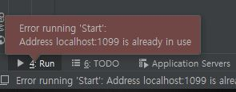

[왜 이럴까...]

물론 이건 Port를 점유한 Process를 중지시키면 되는 아주 단순한 문제이다. 물론 그렇게 해결되었으면 이 글을 쓸 이유도 없었겠지만...

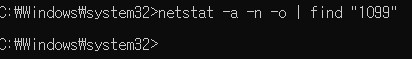

바로 Port를 점유중인 Process가 하나도 존재하지 않은 것이다.


재부팅 해도 실행이 안되는 거 보면 Desktop에 이것저것 설정이 되어있어서 그렇다고 생각할 수 밖에 없다. 무언가 1099포트를 잡고있는 상태에서 실행이 안되고 있던가... 여튼 이럴때는 해결방법이 2개로 나뉠것이다.

- JMX Port를 변경하거나
- 원격지 개발을 진행하거나

둘 다 좋아하는 방법은 아니었다. 그래서 생각한것이 Local이면서 독립적인 개발환경을 가지게 하면 되는것 아닌가? Docker를 사용하자! 라는 결론이었다.

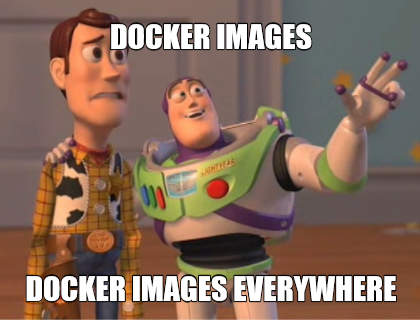

도커는 만능이 아니지만 역시 독립적인 개발환경을 제공해 줌과 동시에 DB 연동도 쉽겠지... 하고 Tomcat Docker 설정을 하였다. 생각보다 어렵지는 않은 작업이었다.

# How To Tomcat Run?

먼저 도커를 사용하기 전 Intellij에서 어떠한 과정을 통해 Tomcat으로 Application을 실행하는지 알아보자.

Inttlij 에서 Run 시킬때 설정해주는 Artifact는 2개로 나뉜다.

- .war 파일
- war exploded 폴더

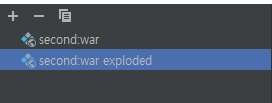

2개는 차이가 있는데 먼저 war 파일의 경우 Intellij가 먼저 Build로 war 파일을 만들어준다. 그러고 나서 해당 war을 Tomcat의 webapps 경로에 넣어주면 Tomcat이 실행 될 때 war파일의 압축을 풀고 해당 파일의 이름대로 경로를 만든다. 과정은 아래와 같다.

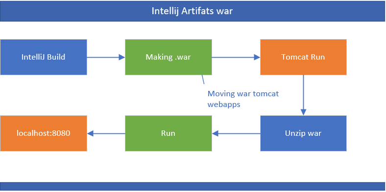

하지만 보통 사용하는 war exploded 을 사용하게 되면 war 형태의 파일이 아닌 Project Name의 압축이 풀린 폴더 형태로 존재하게 된다.

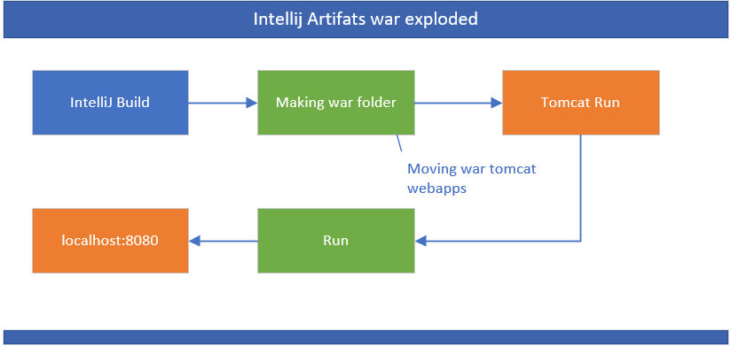

이제 Intellij에서 어떻게 Spring을 Deploy를 하는지 알아보았다. 이제 이를 사용해서 Docker 배포를 해보도록 하겠다.

# Make Docker Compose

Docker의 Tomcat 이미지를 사용해서 Tomcat 개발환경을 구축해보자.

먼저 시나리오를 세워보면

1. Intellij에서 Build를 하고
2. 해당 디렉토리를 Docker의 mount할 Volume으로 지정한 후
3. Tomcat Docker를 실행시키게 되면 정상적으로 Tomcat이 실행이 될 것이다.

기본적으로 Docker Container가 가져야 할 것은 개발을 위한 DB와 Tomcat일 것이고. 이 2개를 Docker hub에서 version을 찾아둔다. Tomcat은 version 8.5를 쓰며 DB로는 mariadb를 쓸 것이다.

생각한 대로 실행을 해야하니 먼저 Docker Compose 파일을 만들었다.

```yml
version: "2"

services:
  database:
    image: mariadb:10.2.20
    environment:
      MYSQL_ROOT_PASSWORD: write your database password
      MYSQL_DATABASE: write your database name
      MYSQL_USER: write your database root user
      MYSQL_PASSWORD: write your database root password
    restart: on-failure

  web:
    image: tomcat:8.5.37-jre11
    volumes:
      - ../target/StartPj2:/usr/local/tomcat/webapps/ROOT
    ports:
      - "8080:8080"
    links:
      - database
```

[docker-compose.yml]

docker-compose를 사용한건 여러 이유가 있지만 먼저 spring에서 intellij를 사용하지 않는 개발환경에서도 쉽게 docker container를 start stop 할 수 있었기 때문이다.

docker compose 파일을 설명해보면 database에는 mariadb를 사용하며 환경변수로 root의 계정과 password 그리고 database name 을 지정해 줬으며 web에는 intellij의  war exploded directory인 **target/StartPj2**를 Tomcat container의 webapps 위치인 **/usr/local/tomcat/webapps/ROOT**로 지정하였다.

그 후 웹서버에 접근할 port를 설정해주고 links 라는 옵션으로 database랑 통신을 할 수 있게 하였다.

# Setting Docker compose Intellij

Docker-compose 파일을 만들었다면 Intellij 에서 Run Configuration 부분에 Docker-compose를 등록시켜 보자. **Add Configuration**을 누르고 Docker Compose를 찾으면 된다.

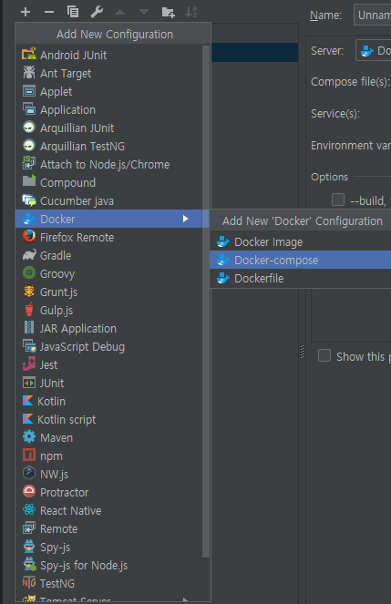

추가를 했으면 Name을 정해주고 Compose파일을 지정해준다. 여기까지는 별 설정을 해줄 것이 없다.

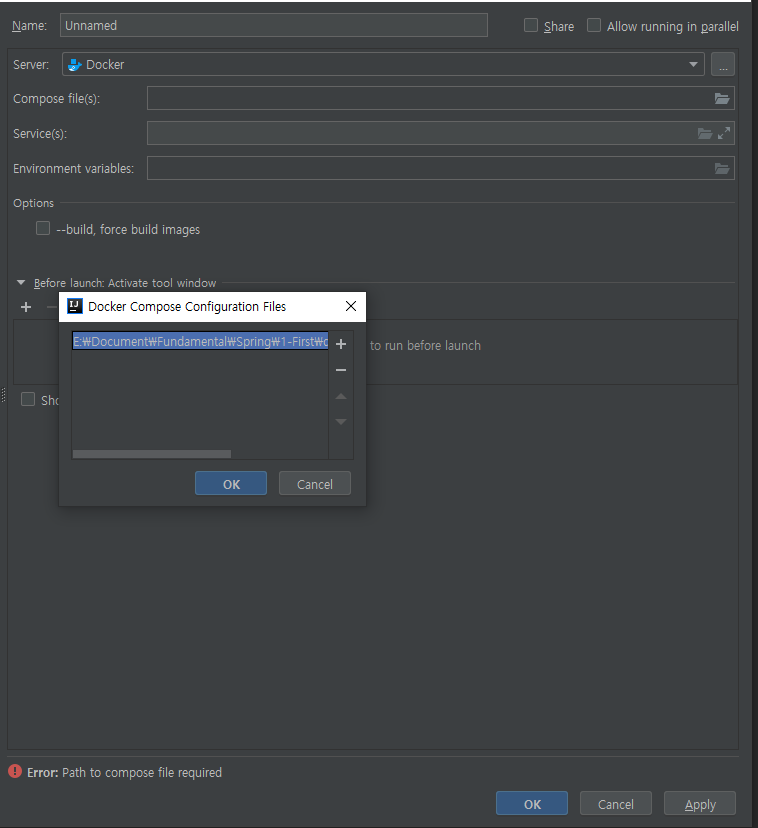

이제 중요한 부분인데 Service(s)를 web, 으로 지정해주면 된다. (혹시 Database를 사용하는 경우 database도 추가해 주도록 하자.) 그리고 --build, force 옵션을 check 후, **Before launch** 옵션을 사용해서 Run 하기 전 Build를 하게 한다.

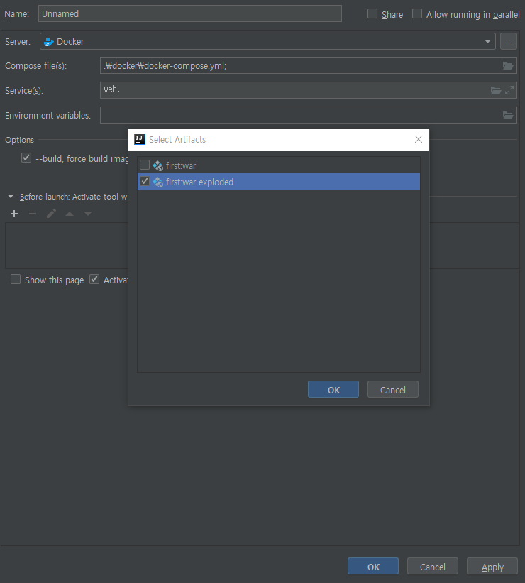

이때 사용할 Build에 대해서 골라주기만 하면 된다.

# Run Project

이제 모든 설정이 끝났다면 Run을 해보자. 아래와 같은 과정을 통해서 동작을 할 것이다.

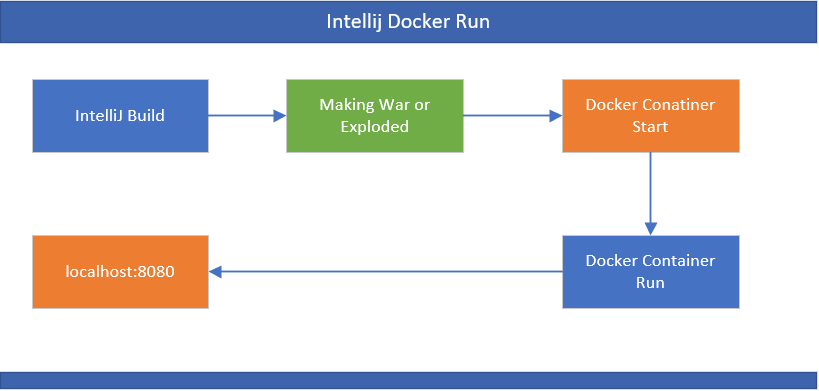

volumes으로 Mount를 해둔 상태이기 때문에 굳이 Deploy 옵션을 추고 Folder를 이동하거나 그럴 필요가 없다. 그리고 Docker 에서 돌아가기 때문에 1099 에러도 뜨지 않을 것이다

이제 Fundamental의 Project 1번을 실행해보자. [Spring Start ! - 2](https://blog.civar.io/posts/fundamental/spring/1)

동일한 결과를 얻을 수 있다.!

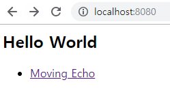