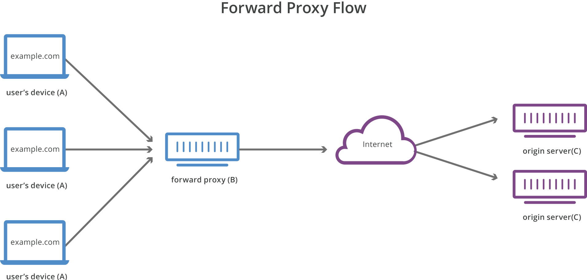

# Nginx Proxy

# Intro

회사에서 서버를 Cloud로 이전한다고 한다... 거기에 따른 Nginx 설정을 요청 받았고 context에 따른 reverse proxy를 우선적으로 요청받아 방법을 모색하던 중, location에 정규식을 사용하여서 필터링을 거치면 되겠다는 답을 얻었다.

설정 파일 만들기 전에 가볍게 공부하면서 생각해보면 나는 대학교 들어오기 전까지 개인적으로 개발을 진행할때는 proxy의 필요성을 별로 느끼지 못했다. 그냥 아 이런게 있어? 신기하네 수준. 본격적으로 Proxy를 쓴 거는 연구실에서 교수님의 요청에 의한 것이었다.

우리 연구실은 소프트웨어연구실은 아니지만 왜 사용을 했냐 하면 아래와 같은 교수님의 니즈가 있었다.

"연구실 홈페이지를 유지하면서 GitLab을 쓰고싶은데 방법이 없을까?"

어느 연구실이 다 그렇듯이 우리 연구실은 학교에서 제공해주는 1개의 domain만 사용하고 있었고 path로 2개의 application을 분리할 수 밖에 없었다. 물론 삽질을 하기 싫었기 때문에 교수님한테 Github을 쓰자고 요청했으나

"그래도 자료는 로컬에 있어야지"

어쩔 수 있나 하라면 해야지... 그때부터 공부를 해서 처음에 고려를 했던 것은 Apache에 있는 Virtual Host 기능을 활용한 reverse proxy였다. 엄청난 삽질을 하면서 알아낸 사실은 "Gitlab에 쓰는 unicorn은 Apache하고 충돌을 일으킵니다" 였다. 그러면서 Haproxy에 존재를 알게되었고 Apache + Haproxy + Docker 라는 이상한 구조의 인프라를 만들게 되었다.

여튼 Haproxy란걸 사용하면서 reverse proxy에 대해 자세히 공부하게 되었다. 

그렇기 때문에 haproxy 혹은 Apache를 통한 reverse proxy는 많이 사용해 봤지만 nginx에서 reverse proxy를 사용한 적은 없어서(역시 원래 쓰던 툴만 쓰게된다) 먼저 nginx proxy에 대해 먼저 공부하고, proxy filtering 용으로 사용할 regex에 대해서 공부하여 완료하였다.

# Proxy?

아마 Proxy란걸 대학교때 인터넷 공학 시간에나 봤던 기억이 있다.(강의를 잘 안듣는 불량학생이다 보니 가물가물 하다.) 

Proxy은 단순하게 선로의 분계기 역할이라고 생각하면 된다. 서버가 한대만 존재하는 건 아니니 여러 서버들의 앞에 붙어서 어느 서버로 보내줄지 결정하는 역할이라는 뜻이다.

뭐... 사용자 입장에서는 Proxy 서버 아래가 어떻게 되어있는지는 알 수 없지만 일반적인 Proxy를 사용하는 환경에서는 www.example.com라는 도메인이 요청을 들어왔을때, 이 요청을 A서버, B서버, C서버 등 어느 서버로 보내줄지 결정해주는 역할이다.

아래와 같은 conf를 보자.

    location / {
    	proxy_path http://127.0.0.1:80/proxy_1
    }
    
    location /a {
    	proxy_path http://127.0.0.1:80/proxy_a
    }

단순하게 reverse proxy를 처리해주는 nginx conf의 한 부분이다. / 라는 요청이 들어온다면 proxy_1로 요청을 던져 data를 가져와 줄 것이고 /a 로 요청이 들어온다면 proxy_a로 던져서 가져올 것이다.

하지만 이건 웹 개발을 해본 사람이라면 controller랑 다를게 없지 않냐고 말할 수 있다. 그렇다면 아래와 같은 설정을 보자

    location / {
    	proxy_path http://127.0.0.1:80/proxy_1
    }
    
    location /a {
    	proxy_path http://10.1.2.3:80/proxy_a
    }

바뀐 부분을 볼 수 있겠는가? 단순히 / 로 접근을 해오면 proxy_1로 던져서 받아오겠지만 /a 로 들어오게 되면 10.1.2.3 이라는 서버의 /proxy_a 를 가져올 것이다. 이렇게 proxy는 다중 도메인 환경에서 사용하기 용이한 것이다. 물론 단일 노드에서 여러 어플리케이션을 port로 구분해 서비스 할때도 사용할 수 있다.

이렇게 Proxy는 요청 들어온 도메인에 대해서 분류해주는 중계기 역할이란걸 알게 되었다. 그럼 좀 더 자세히 알아보자 프록시는 Forward Proxy와 Reverse Proxy로 분류된다.

## Forward Proxy

번역하면 순방향 프록시인데... 굳이 번역할 필요가 있나 싶다 괜히 번역해서 뜻을 더 어렵게 만드는 그런 류인거 같은데 말 그래도 포워딩 해주는 Proxy 란 뜻이다. 이걸 어디서 쓰냐 하면 기업 내부에서 외부로 나가는 중간에 설정된다.

> Forward Proxy는 내부 → 외부 로 나갈때 사용된다.

[그림은 Cloudflare의 Reverse Proxy Learning Objectives]

크게 두가지 이유로 사용하는데

1. 보안 : 어찌되었든 밖으로 나가거나 들어오려면 Proxy 서버를 거쳐야 하기 때문에 In bound / Out bound 적용이 편해진다.
2. 성능 : Proxy 서버 내부에 cache를 사용하여 한번 나간 외부 통신을 다시 접속할시 cache 데이터로 대체할 수 있다.

Nginx 에서 Forward Proxy를 구축하는 설정파일은 좀 재밌게 생겼는데

    server {
        listen       8888;
    
        location / {
            resolver 8.8.8.8;
            proxy_pass http://$http_host$uri$is_args$args;
        }
    }

이런식으로 생겼다.

resolver는 proxy_path가 조회할 dns 주소를 뜻하고 proxy_pass를 보면 인자값으로 떡칠되어 있는데 이는 패턴을 정해서 proxy_pass 해줄 수 없기 때문이다. (내부에서 외부로 나가는 연결을 어떻게 추론하겠는가)

한가지 알 수 있는 사실은 Proxy는 DNS로 조회만 가능하다면 어디에 있든 Proxy 설정이 가능하다는 뜻이다.

## Reverse Proxy

이건 역방향 Proxy인데 Forward Proxy가 내부 → 외부 에 사용하는 Proxy 아니었는가? Reverse는 반대로 외부 → 내부로 들어올때 사용하는 Proxy이다. 아마 우리가 사용하는 대부분의 Proxy는 Reverse Proxy가 될 것이다.

> Reverse Proxy는 외부 → 내부 로 들어올때 사용된다.

[그림은 Cloudflare의 Reverse Proxy Learning Objectives]

Reverse Proxy 역시 크게 두가지 장점이 있다.

1. 보안 : Forward Proxy와는 다르게 Reverse Proxy는 내부망과 외부망의 분리라는 이점이 있다. Reverse Proxy를 구축해둘 시 외부망에서는 내부망의 사정을 모르고 단순하게 Proxy 서버에 요청을 하면 알아서 Proxy서버가 내부망을 뒤져서 리턴해주기 때문이다.
2. 로드밸런싱 : 사실 이건 앞에 L4 / L7 같은 물리적 로드밸런싱 장비를 붙여도 되지만 국소적으로 Proxy 서버를 통해 들어오는 연결에 한해서는 서버간의 로드밸런싱이 가능하다는 뜻이다.

    server {
        listen       8888;
    
        location / {
            resolver 10.1.1.1;
            proxy_pass http://www.example.com;
        }
    }

Reverse Proxy 설정파일은 대부분 위의 형태를 띄게 되는데 밖에서 안으로 들어오는 연결은 추론이 가능하기 때문에 중계기 역할이라고 이해하면 된다. forward와는 다르게 resolver는 내부에 있는 서버를 조회할 수 있는 DNS 서버 주소를 적어야 하고 proxy_pass 역시 보통은 내부망의 서버 도메인이다.

위에서 본 것처럼 revese proxy와 forward proxy를 구분하는건 방향이라는 것만 인지하면 될 것이다. 물론 학생때는 기업규모의 큰 서버를 볼 일이 없으니 감이 안잡힐 수도 있지만 그냥 두 Proxy의 차이가 있다는 점만 알면 될 것이다.

## 마치며...

원래 location에 들어가는 정규식도 적을까 했지만 글이 너무 길어지면 읽기가 싫어지니 단순하게 Forward와 Reverse의 정의만 내렸다. 생각해보면 굳이 Nginx Proxy가 아니었어도 될 제목이긴 했는데... 어쨌든 Proxy는 언젠간 쓸 일이 올 가능성이 큰 기능이기 때문에 사용하지 않더라도 개념은 익혀두길 추천하며 다음에는 Nginx에서 사용하는 정규식을 적어봐야겠다.